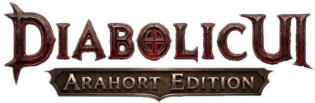

  

Orb-based graphical user interface replacement for World of Warcraft.

If you want to help the project, the **best help** would be a **key** for Midnight! I want to play with you too :)

## About This Fork

This is a **community-maintained fork** of the original [Diabolic UI](https://www.curseforge.com/wow/addons/diabolicui) by Lars "Goldpaw" Norberg.

**Important:** The original Diabolic UI is **no longer functional** in modern World of Warcraft (11.2.7+). This fork has been completely rebuilt to work with current game versions.

### Original Project Credits

- **Original Addon:** [Diabolic UI](https://www.curseforge.com/wow/addons/diabolicui)
- **Original Code & Artwork:** Lars "Goldpaw" Norberg
- **Original License:** Custom License (All Rights Reserved)

### This Fork

- **Updated for WoW 11.x and 12.x by:** Alex Arahort
- **Artwork:** Alex Arahort and [Karina Kisenkova](https://www.behance.net/kisenkova)
- **Status:** Fully functional for The War Within (11.2.7+) and Midnight (12.x)
- **License:** Community Fork - respecting original authors' work

## What's Different From the Original

The original Diabolic UI **stopped working completely** after Blizzard's API changes in WoW 11.x. This edition includes:

### Core Fixes (Making it Work Again)

- Complete API migration to WoW 11.x and 12.x standards

### UI Improvements

- New Diablo 2 Ressurected design

### Features

- Tooltips follow mouse cursor - integrated TTOM functionality with customizable offset
- Auto-fill delete confirmation - no need to type "DELETE" manually when destroying items
- Minimap button collector - integrated MinimapButtonButton functionality, addon buttons are organized into a compact dropdown near the minimap
- EditMode support
- Native real-time settings
- Hotkeys for hidden actionbars

## Requirements

World of Warcraft **Retail 11.2.7** (The War Within) or **12.0.0** (Midnight)

## Installation

1. Download the addon
2. Extract to `World of Warcraft\_retail_\Interface\AddOns`
3. Restart WoW or type `/reload` in-game

---

## Support

This is a community-maintained fork. For issues or feature requests, please visit:

- **GitHub:** https://github.com/Arahort/diabolic
- **CurseForge:** https://www.curseforge.com/wow/addons/diabolicui-arahort-edition
- **Discord:** https://discord.com/channels/407765646634385408/1478671797695025272

### Support the Developer

- **Patreon:** https://www.patreon.com/c/Arahort
- **Boosty:** https://boosty.to/alex_arahort

#### Crypto:

- USDT TRC20: `TShMCz6xGiLvtES8JquqhavrMvFnLM4UQ4`
- USDT TON: `UQAKgkYbTk9qWICUn4O249X4F_hqPUHUpCEXNONLbHVfUjcc`
- BTC: `bc1q89d70zz5v0f0x00pulrdggmmfav35c0nm99ua3`

---

## List of Add-ons Present in the Video 3.0

- Scrap
- Almost Completed Achievements
- BugGrabber
- BugSack
- DragonRider
- AllTheThings
- Auctinator
- Baganator
- Syndicator
- Chattynator
- Platynator
- Better Fishing
- BindPad
- NotePad
- Dialogue UI
- Plumber
- TomTom
- Waypoint UI
- Opulent Casting Bars

## Platynator preset By SaiyaRatt and Arahort

1. Install addon SharedMedia
2. Read `_retail_/Interface/AddOns/SharedMedia/INSTRUCTIONS for MyMedia.txt` and use `MyMedia.bat`
3. Copy `.tga` files from `_retail_/Interface/AddOns/DiabolicUI/Assets/statusbar/` to `_retail_/Interface/AddOns/SharedMedia_MyMedia/statusbar`
4. Use `_retail_/Interface/AddOns/DiabolicUI/Assets/statusbar/platynator_profile.txt`

## UI preset

`DiabolicUI/Assets/statusbar/ui_profile.txt`

---

## Changelog

See [CHANGELOG.md](CHANGELOG.md) for full version history.
